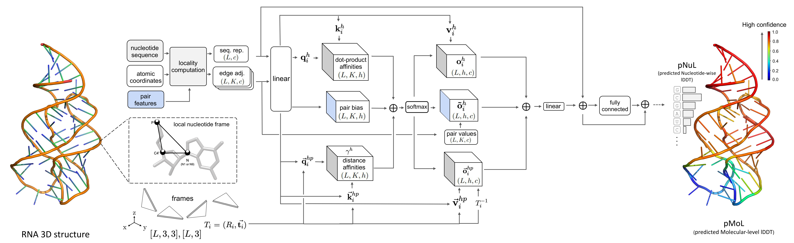

# lociPARSE: a locality-aware invariant point attention model for scoring RNA 3D structures

by Sumit Tarafder and Debswapna Bhattacharya.

Submitted, 2023.




## Installation

1. Use conda virtual environment to install dependencies for lociPARSE. The following command will create a virtual environment named 'lociPARSE'.

```
conda env create -f lociPARSE_environment.yml
```

2. Activate the virtual environment

```
conda activate lociPARSE
```

## Usage

Instructions for running lociPARSE:

1. Put the desired pdb(s) inside the 'Input' folder.

2. Put the PDB ID or list of IDs in the text file named 'input.txt' inside 'Input' folder. See the example in the 'Input' folder.

3. Run
   ```
   chmod a+x runQA.sh && ./runQA.sh
   ```

5. The script will generate features for every ID listed in Input/input.txt and store in individual folder inside 'Feature' folder. Then it will run inference and store global lDDT prediction per target (pMoL) and per nucleotide prediction (pNuL) in individual folder inside 'Prediction' folder.
